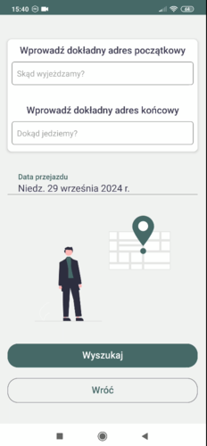
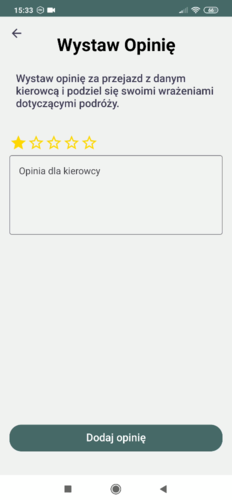

# Zaufany Kierowca 🚗

> **Note:** This repository does not contain the full code for the Zaufany Kierowca app. Some parts of the implementation have been omitted for security or privacy reasons.

**Zaufany Kierowca** is a ride-sharing mobile application that connects passengers with drivers. It allows users to publish rides, reserve them, and manage ride details through an intuitive interface, complete with real-time notifications and map integration. Built using **React Native** and **TypeScript** for the frontend, and **Node.js** with **TypeScript** for the backend, it offers a full-stack solution with real-time data and seamless user interaction.

## 📹 Demo Videos

Here are some demo videos showcasing key features of the app:

### 1. Registration Process

> Watch the video to see how users register on the app.

### 2. Add and Delete Ride

> This demo shows how a user can create a ride with Google Maps integration and later delete it.

### 3. Find Ride and Make/Delete a Reservation

> Discover how users search for available rides, reserve them.

### 4. Add Opinion

> After completing a ride, users can leave opinions and reviews for other drivers. Check out this feature in action.

## 📱 How It Works & Features

### User Authentication

- **Sign In**: Simple and secure authentication for users.
- **Register**: Users register by providing an email, verified through a code sent via **nodemailer**.
- **Password Recovery**: Reset forgotten passwords through a link sent to the user's email.

### Ride Management

#### Publish a Ride

- Input your **origin** and **destination** addresses using Google Maps integration.
- Add additional details such as the **date of the ride**, **number of passengers**, and **preferences**.
- Users can see the published ride in their searches.

#### Reserve a Ride

- Search for available rides by providing **origin**, **destination**, and **date**.
- If a ride matches, you can reserve it.
- Notifications are sent via **Firebase Cloud Messaging** (FCM) for reservation updates.

#### Cancel Ride

- Cancel a ride at any time, and users will be notified via **FCM** about the cancellation.

### Ride History & Reviews

- **Ride History**: Track your ride history and view details of rides you've created or reserved.
- **Post-Ride Feedback**: After completing a ride, users can leave a review (opinion) for the driver and the ride. Reviews are visible on user profiles to assist others in choosing drivers.
- **Profile Reviews**: View the reviews you've given and received on your profile.

### Profile Management

- **Profile Editing**: Easily manage your profile by adding or editing personal details and profile photos.
- **Travel Stats**: The app tracks kilometers traveled, which can be viewed in the user’s profile.
- **Sign Out**: Easily sign out from your account.

### Notifications

- Users are notified of key events (e.g., ride cancellation, reservation updates) via **Firebase Cloud Messaging** (FCM).

## 🛠️ Tech Stack

### Frontend

- **React Native**: For building cross-platform mobile applications (iOS & Android).
- **TypeScript**: Ensures type safety and code quality.
- **Expo**: For rapid development and deployment.
- **Redux Toolkit (RTK Query)**: Manages application state and API calls efficiently.
- **Firebase**: Used for authentication, FCM (push notifications), and data management.

### Backend [(Backend Repository)](https://github.com/kacperzolkiewski/zaufany_kierowca_backend)

- **Node.js**: For handling server-side operations.
- **TypeScript**: Ensures strong typing and better developer experience.
- **Express**: Lightweight and efficient web framework for building the API.
- **Nodemailer**: Used for sending email verification and password recovery links.
- **TypeORM**: ORM for managing database interactions with **PostgreSQL**.
- **PostgreSQL**: Relational database for storing user data and ride details.

## 🏗️ Architecture & Design

- **Figma** was used to design the app, ensuring a clean and user-friendly interface.
- The app follows **REST API** principles, and **TypeORM** was used for efficient database management.
- State management and API requests are handled using **Redux Toolkit RTK Query**.

## 🔗 API Integration

- **Google Maps API**: Used for address input, map routes, and displaying directions.
- **Firebase Cloud Messaging (FCM)**: For sending push notifications, including ride cancellations, reservations.
- **Nodemailer**: For sending email verification and password recovery links.
- **Firebase Storage**: Utilized to store user profile photos, allowing users to upload, update, and retrieve their profile pictures efficiently.

## 🚀 Future Enhancements

- **Real-Time Chat** between drivers and passengers to improve communication before the ride.
- **Advanced Ride Filtering** based on user preferences such as smoking, pets, or quiet rides.
- **Ride Availability Notifications**:
  - If a user searches for a ride on a specific date and no rides are available, they will have the option to request a **notification**.
  - Once a ride matching their search criteria is published for that date, the user will be notified via **push notification** (FCM) that a new ride is available.
  - This feature will help users avoid checking the app repeatedly and improve the user experience by alerting them when a ride becomes available.

## 💬 Contact

If you have any questions or want to discuss my project, feel free to reach out!

- **Email**: kacperzolkiewski@gmail.com
- **LinkedIn**: [Kacper Żółkiewski](https://www.linkedin.com/in/kzolkiewski/)
